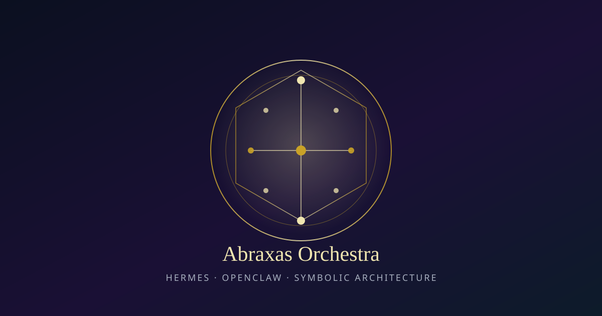

# Abraxas Orchestra

<p align="center">
  
</p>

<p align="center">
  <strong>Hermes + OpenClaw coding-agent skill</strong> for symbolic code architecture
</p>

Version **0.1.2** · Skill name: `orchestra` · Python ≥ 3.11 · Network: not required

Maps software structure onto traditional correspondence systems (Tree of Life, alchemy, runes, planetary spheres, I Ching, Solomonic ranks, Peircean signs, Numogram, sacred geometry, Enochian, Chaos Magic) and emits **dual-named skeletons** with recoverable provenance.

Fail-closed on weak mappings. Human sovereignty over forced maps. Corpus open for expansion.

---

## Quick start

**Deploy to Hermes/OpenClaw:** follow [`docs/DEPLOY.md`](docs/DEPLOY.md) (validate → dry-run → install → verify → wire host).

**Freeze checklist:** [`docs/COMPLETION.md`](docs/COMPLETION.md)

```bash
git clone https://github.com/scrimshawlife-ctrl/Abraxas-Orchestra-Hermes.git
cd Abraxas-Orchestra-Hermes

bash scripts/smoke.sh
python3 scripts/orchestra.py check
python3 scripts/orchestra.py do list-frameworks
python3 scripts/orchestra.py do structure -f tree-of-life -c "intent,synthesis,output"
```

Install into an agent host:

```bash
bash install.sh --dry-run
bash install.sh                                          # → ~/.hermes/skills/orchestra
bash install.sh --target ~/.openclaw/skills/orchestra    # OpenClaw
```

---

## Release notes

**Current: [0.1.2](docs/RELEASE_NOTES.md#012--2026-08-04)** (2026-08-04) — private Hermes/OpenClaw production bar.

| Theme | What landed |
|-------|-------------|
| Single source of truth | `schemas/frameworks.v1.json` drives CLI loci |
| Packaging | Smoke script, 17 unit tests, CI 3.11/3.12, atomic install |
| Deploy | Ordered path in `docs/DEPLOY.md` |
| Examples | Signal-forager pipeline; Enochian + Chaos session |

Full narrative: **[`docs/RELEASE_NOTES.md`](docs/RELEASE_NOTES.md)** · Machine changelog: [`CHANGELOG.md`](CHANGELOG.md)

---

## How to use

### For humans

| Goal | Command |
|------|---------|
| Validate install | `python3 scripts/orchestra.py check` |
| Full smoke | `bash scripts/smoke.sh` |
| See frameworks | `python3 scripts/orchestra.py do list-frameworks` |
| Emit skeleton (stdout) | `python3 scripts/orchestra.py do structure -f <framework>` |
| Emit + write disk | `… do structure -f <framework> --out ./my-skeleton` |
| Overlay second map | `… do structure -f enochian -o chaos-magic` |
| Collapse oversized map | `… do project -f tree-of-life --out ./projected` |
| Working pipeline demo | `cd examples/signal-forager-skeleton && python3 run_demo.py` |

**Framework keys:** `tree-of-life` · `alchemical-stages` · `elder-futhark` · `planetary-spheres` · `iching-hexagrams` · `solomonic` · `peircean-signs` · `numogram` · `sacred-geometry` · `enochian` · `chaos-magic`

### For agents

1. **Discover** — Frontmatter `name` + `description` in `SKILL.md`.
2. **Activate** — Mandatory sequence in `SKILL.md`.
3. **Deepen on demand** — Open only needed `references/` files.
4. **Execute** — Prefer `scripts/orchestra.py`.
5. **Build code** — Apply `references/agent-posture.md`.

Do **not** invent symbolic loci to satisfy a map. Return `NOT_COMPUTABLE` or mark `FORCED` and stop.

### Definition of done

- Dual-named module list (mechanical primary, symbolic secondary)
- Correspondence table JSON matching `schemas/correspondence-table.v1.schema.json`
- Status `CLEAN`, or explicit `FORCED_CORRESPONDENCE` / pragmatic projection note
- No silent collapse; no occult names as sole public API unless requested

---

## What this skill is / is not

| Is | Is not |
|----|--------|
| Architecture structuring skill | Runtime ritual / operative magic |
| Dual-name + provenance emitter | Auto-canon promotion into Abraxas |
| Hermes + OpenClaw portable package | Network service or SaaS |
| Open correspondence corpus | Speculative deep trees without projection |

---

## Repository layout

```text
assets/hero.svg          # README hero (JPEG optional)
SKILL.md                 # Agent contract
orchestra.manifest.yaml  # Install / discovery metadata
scripts/orchestra.py     # CLI
scripts/smoke.sh         # Production smoke
references/              # Framework tables + agent-posture
schemas/                 # correspondence-table.v1 + frameworks.v1
examples/                # signal-forager; enochian-chaos
tests/                   # stdlib unittest
docs/                    # DESIGN, DEPLOY, COMPLETION, RELEASE_NOTES, …
install.sh               # Atomic installer
```

---

## Documentation map

| Doc | Audience |
|-----|----------|
| `SKILL.md` | Agents |
| `README.md` | Humans + agents |
| `docs/COMPLETION.md` | v0.1.2 freeze checklist |
| `docs/RELEASE_NOTES.md` | Narrative release notes |
| `docs/DEPLOY.md` | Ordered deployment next steps |
| `docs/ROADMAP.md` | Done / deferred / production bar |
| `docs/DESIGN.md` | Design rationale |
| `docs/OPENCLAW.md` | OpenClaw packaging |
| `docs/COMMUNITY.md` | Community-skills compliance |
| `docs/SECURITY.md` | Local threat model |
| `references/agent-posture.md` | Code implementation posture |
| `CHANGELOG.md` | Machine version history |

---

## Safety and requirements

- **Runtime:** Python 3.11+ standard library only for the CLI
- **Network:** Not required for `check` / `structure` / `project`
- **State:** Mutable state stays outside the install root
- **Destructive ops:** Installer replaces target after backup; use `--dry-run` first
- **License:** Proprietary evaluation terms — see `LICENSE`

---

## Links

- Repo: https://github.com/scrimshawlife-ctrl/Abraxas-Orchestra-Hermes
- Freeze checklist: [`docs/COMPLETION.md`](docs/COMPLETION.md)
- Release notes: [`docs/RELEASE_NOTES.md`](docs/RELEASE_NOTES.md)
- Deploy: [`docs/DEPLOY.md`](docs/DEPLOY.md)
