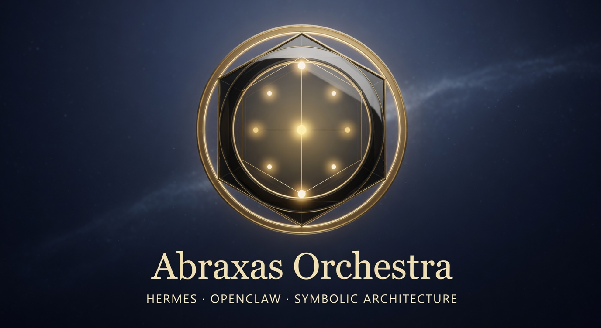

# Abraxas Orchestra

**Site:** [https://scrimshawlife-ctrl.github.io/Abraxas-Orchestra/](https://scrimshawlife-ctrl.github.io/Abraxas-Orchestra/) · [Python best-case: optimized by structure](https://scrimshawlife-ctrl.github.io/Abraxas-Orchestra/#before-after) · example `examples/python-tree-of-life-pipeline/` · measurable [structure benchmark](examples/benchmark-tree-of-life/)

<p align="center">
  
</p>

<p align="center">
  <strong>Hermes + OpenClaw coding-agent skill</strong> for structuring software with traditional symbolic maps
</p>

Version **0.6.0** · Skill name: `orchestra` · Python ≥ 3.11 · Offline CLI · License: [Apache-2.0](LICENSE)

---

## What this is (plain English)

**Orchestra** is a local skill that helps coding agents (and humans) organize software the way traditional systems organize meaning — Tree of Life, alchemy stages, runes, planetary spheres, I Ching, Solomonic ranks, Peircean signs, Numogram, sacred geometry, Enochian, Chaos Magic.

In practice it does three things:

1. **Scaffold** — emit a dual-named project skeleton (mechanical name + symbolic name) from a chosen map  
2. **Diagram** — write HTML, JSON, and Mermaid architecture graphs next to that skeleton  
3. **Analyze → plan → optionally rename** — read a local tree (Python by default; optional multi-lang), map modules onto a framework when the fit is honest, propose renames, and only write files when you explicitly confirm

It is **not** a network service, a magic runtime, or a silent auto-refactorer. Weak or forced mappings are labeled and can stop the pipeline. You stay in control of anything that changes the filesystem.

**Analyze language limits:** Python uses a full AST. JavaScript/TypeScript, Go, Rust, and Ruby use **import-surface** token parsers (dependency edges only — not full language compilers or type-aware resolve). Prefer `--lang auto` for mixed trees; treat non-Python graphs as best-effort OBSERVED structure.

---

## How to use

### Install once

```bash
git clone https://github.com/scrimshawlife-ctrl/Abraxas-Orchestra.git
cd Abraxas-Orchestra
bash scripts/smoke.sh                    # must print SMOKE OK
bash install.sh --dry-run
bash install.sh                          # → ~/.hermes/skills/orchestra
# OpenClaw:
# bash install.sh --target ~/.openclaw/skills/orchestra
```

After install, the host discovers the skill from `SKILL.md` (`name: orchestra`).

### Day-to-day commands (router groups)

Same groups for **CLI** and **Hermes** agents (`CommandRouter` / `SKILL.md`):

| Group | Commands | Purpose |
|-------|----------|---------|
| **meta** | `check`, `list` | Integrity + framework discovery |
| **emit** | `structure`, `project`, `diagram` | Skeleton + diagrams from a framework |
| **repo** | `analyze`, `optimize` | Observe existing tree → plan → gated apply |

All commands work from the repo or install root (`~/.hermes/skills/orchestra`).

**meta — list maps**

```bash
python3 scripts/orchestra.py list
python3 scripts/orchestra.py check
```

**emit — scaffold** (Tree of Life, three concerns)

```bash
python3 scripts/orchestra.py structure \
  -f tree-of-life \
  -c "intent,synthesis,output" \
  --out /tmp/orch-skel
```

Writes under `--out`:

- `SKELETON.md` + per-module stubs with locus **ALLOWED** / **FORBIDDEN** contracts (`run()` + `contract()`)  
- `pipeline.py` when two or more stages are emitted (calls stages in map order)  
- `correspondence-table.json`  
- `architecture.html` · `architecture.json` · `architecture.mmd` (auto)

**emit — project** (collapse oversized / forced maps):

```bash
python3 scripts/orchestra.py project -f enochian -o chaos-magic --out /tmp/orch-proj
```

**emit — diagram only**:

```bash
python3 scripts/orchestra.py diagram -f numogram --out /tmp/orch-diag
```

**repo — analyze** (Python AST by default; also js/ts/go/rust/ruby/`auto`)

```bash
python3 scripts/orchestra.py analyze \
  --path /path/to/your/package \
  -f tree-of-life \
  --out /tmp/orch-an

# Multi-language tree
python3 scripts/orchestra.py analyze --path . --lang auto --out /tmp/orch-an
```

Produces `analysis.json` (with embedded **`metrics`**), `structure-metrics.json`, and the same diagram trio. Mapping strengths: `STRONG` / `ADEQUATE` / `WEAK` / `FORCED`. Weak or forced maps fail closed (non-zero exit) so agents do not “paper over” bad fits. Non-Python languages contribute OBSERVED import edges only; framework mapping still keys off path/name tokens. Compare structure with `examples/benchmark-tree-of-life/harness.py`.

**repo — optimize plan** (read-only)

```bash
python3 scripts/orchestra.py optimize \
  --from /tmp/orch-an/analysis.json \
  --out /tmp/orch-plan
```

Writes `optimize-plan.json` and `OPTIMIZE.md`. **No source tree changes.**

**repo — apply gated moves** (rename / promote / flatten)

```bash
# Dry-run first
python3 scripts/orchestra.py optimize --from /tmp/orch-an/analysis.json --apply
# Optional: --steps step-1,step-3  or  --actions suggest_rename,suggest_boundary

# Only when you mean it — backs up, then writes; optional re-analyze
python3 scripts/orchestra.py optimize \
  --from /tmp/orch-an/analysis.json \
  --apply --confirm --refresh
```

### When Hermes should call this skill

Route first (**meta** / **emit** / **repo**), then run the matching CLI command:

| User wants… | Group | Commands |
|-------------|-------|----------|
| Is the skill healthy? What maps exist? | **meta** | `check`, `list` |
| New dual-named skeleton or diagram from a map | **emit** | `structure`, `project`, `diagram` |
| Observe / map / refactor an existing tree | **repo** | `analyze`, `optimize` |

Prefer `structure` / `project` / `analyze` with `--out` over inventing ad-hoc Mermaid. Do not invent loci that are not in `schemas/frameworks.v1.json`. Full agent contract: installed `SKILL.md` + `references/agent-posture.md`.

### Integrity + coverage

```bash
python3 scripts/orchestra.py check
python3 scripts/bump_version.py check
python3 scripts/integrity_check.py
python3 scripts/coverage_report.py --gate   # hard floors (same as CI coverage-gate)
```

### Contributing / main branch

`main` requires a **pull request** and a green **`ci-ok`** check. Administrators are **not** exempt (no status-check bypass). See [`docs/CI.md`](docs/CI.md).

---

## Quick start (minimal)

```bash
git clone https://github.com/scrimshawlife-ctrl/Abraxas-Orchestra.git
cd Abraxas-Orchestra
bash scripts/smoke.sh
python3 scripts/orchestra.py list
python3 scripts/orchestra.py structure -f tree-of-life -c "intent,synthesis,output" --out /tmp/orch-skel
```

Full deploy path (Hermes/OpenClaw): [`docs/DEPLOY.md`](docs/DEPLOY.md)  
Publish freeze: [`docs/COMPLETION.md`](docs/COMPLETION.md) · Public debut: [`docs/PUBLIC_RELEASE.md`](docs/PUBLIC_RELEASE.md)

---

## Release notes

**Current: 0.6.0** — multi-lang analyze (AST-grade import parsers), coverage-gate floors, branch protection on `main` (see `CHANGELOG.md`). Prior: [0.4.0](docs/RELEASE_NOTES.md#040--2026-08-05) broader `safe_apply`.

| Theme | What landed |
|-------|-------------|
| Semver | `docs/SEMVER.md`, `scripts/bump_version.py`, CI parity |
| Analyze | OBSERVED graphs: Python AST; JS/TS/Go/Rust/Ruby import-surface parsers; `--lang auto` |
| Optimize | Plan only by default; `--apply --confirm` gated rename/promote/flatten + backup |
| Diagrams | Auto HTML/JSON/Mermaid on structure/project/analyze `--out` |
| Metrics | `analyze` embeds map quality / cycles / mix; `structure-metrics.json` on `--out` |
| CI | `ci-ok` required on `main` (admins enforced); integrity + coverage-gate |
| Release | `.github/workflows/release.yml` on tag push |

Narrative: [`docs/RELEASE_NOTES.md`](docs/RELEASE_NOTES.md) · Changelog: [`CHANGELOG.md`](CHANGELOG.md)

---

## Frameworks

Eleven maps ship in `schemas/frameworks.v1.json`:

`tree-of-life` · `alchemical-stages` · `elder-futhark` · `planetary-spheres` · `iching-hexagrams` · `solomonic` · `peircean-signs` · `numogram` · `sacred-geometry` · `enochian` · `chaos-magic`

Human-readable tables: `references/`. Agent posture when filling stubs: `references/agent-posture.md`.

---

## Layout

```text
SKILL.md                 # Agent contract + triggers
scripts/orchestra.py       # CLI entry
scripts/orchestra_router.py # Command registration + dispatch
scripts/analyze_repo.py    # Analyze walk + mapping
scripts/analyze_langs.py   # Multi-lang import-surface parsers
scripts/diagram_emit.py    # HTML / graph emission
scripts/diagram_mermaid.py # Mermaid writer
scripts/coverage_report.py # Soft report + --gate floors
scripts/bump_version.py    # Semver parity tool
scripts/smoke.sh           # Production smoke
references/                # Framework tables + agent-posture
schemas/                   # correspondence, frameworks, analysis, optimize-plan
examples/                  # signal-forager; enochian-chaos; tree-of-life pipeline; structure benchmark
tests/                     # stdlib unittest + fixtures
docs/                      # DESIGN, DEPLOY, CI, SEMVER, …
install.sh                 # Atomic installer (path jail)
LICENSE / NOTICE           # Apache-2.0
```

---

## Documentation map

**Canonical (source of truth for the current tree):**

| Doc | Role |
|-----|------|
| `VERSION` | Single version number for the package |
| `CHANGELOG.md` | Machine-oriented version history |
| `docs/SECURITY.md` | Live threat model and write surfaces |
| `SKILL.md` | Agent contract + current commands |
| `README.md` | Humans + agents (this file) |
| `docs/DESIGN.md` | Current design rationale / executable surface |
| `docs/SEMVER.md` | Version bump policy |
| `docs/DEPLOY.md` | Install and host wiring |

**Supporting (still accurate, not version history):**

| Doc | Audience |
|-----|----------|
| `docs/CI.md` | Actions + **branch protection** (required `ci-ok`, no admin bypass) |
| `docs/FRAMEWORK_FIT.md` | Which map to use; strength labels |
| `scripts/coverage_report.py` | Soft report + `--gate` hard floors |
| `docs/ANALYZE_OPTIMIZE_PLAN.md` | Analyze → optimize design (shipped) |
| `docs/OPENCLAW.md` | OpenClaw packaging |
| `docs/COMMUNITY.md` | Community-skills notes |
| `references/agent-posture.md` | How agents fill skeletons |
| `docs/SECURITY_AUDIT.md` | Audit history + status addenda (see SECURITY.md for live rules) |

**Historical / freeze notes (not the live CLI surface):**

| Doc | Role |
|-----|------|
| `docs/COMPLETION.md` | Production freeze checklist (point-in-time) |
| `docs/PUBLIC_RELEASE.md` | Public debut notes |
| `docs/RELEASE_NOTES.md` | Narrative releases |
| `docs/RELEASE_BODY_v*.md` | Tag release body drafts |
| `docs/RESTORE_NOTE.md` | 0.3.2 CLI restore incident marker |

---

## Safety and requirements

- **Runtime:** Python 3.11+ standard library only for the CLI  
- **Network:** Not required for check / structure / project / diagram / analyze / optimize  
- **Install jail:** Refuses system paths and targets outside `$HOME` unless `--allow-outside-home`  
- **Writes:** Installer backs up then swaps; optimize apply requires `--confirm`; prefer dry-run first  
- **State:** Keep mutable agent state outside the skill install root  
- **License:** Apache-2.0 — see `LICENSE` and `NOTICE`  

Details: [`docs/SECURITY.md`](docs/SECURITY.md) (live) · [`docs/SECURITY_AUDIT.md`](docs/SECURITY_AUDIT.md) (history)

---

## Links

- Repo: https://github.com/scrimshawlife-ctrl/Abraxas-Orchestra  
- **Site (GitHub Pages):** https://scrimshawlife-ctrl.github.io/Abraxas-Orchestra/  
- Deploy skill: [`docs/DEPLOY.md`](docs/DEPLOY.md)  
- CI / branch protection: [`docs/CI.md`](docs/CI.md)  
- Semver: [`docs/SEMVER.md`](docs/SEMVER.md)  
- Changelog: [`CHANGELOG.md`](CHANGELOG.md)  
