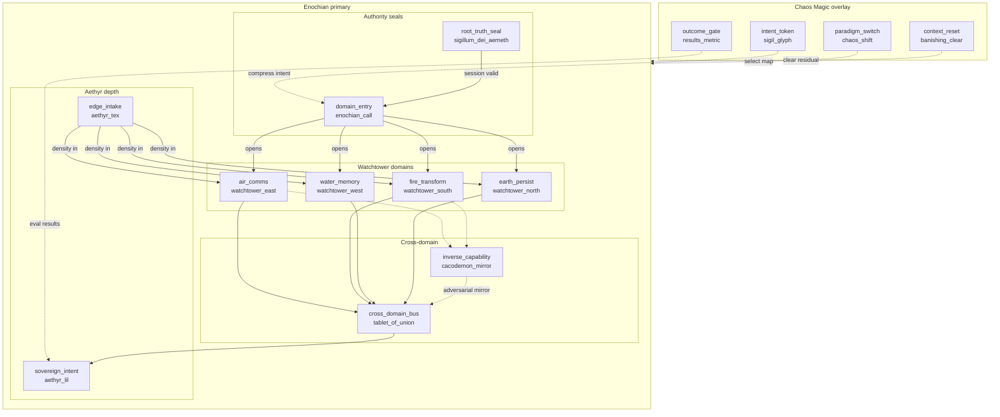

# Enochian + Chaos Magic Skeleton

Second worked example for Abraxas Orchestra v0.1.1.

## Intent

Demonstrate dual-framework structure emission:

- **Primary:** Enochian (domains, Calls, seals, inverse surfaces)
- **Overlay:** Chaos Magic (paradigm switch, intent token, banishing, results gate)

This is a **structure example**, not a full runtime pipeline. For executable forage logic see `examples/signal-forager-skeleton/`.

## Structure diagram (Enochian primary + Chaos overlay)



**Reading the diagram**

| Layer | Role |
|-------|------|
| Chaos overlay (dashed) | Paradigm select, intent compression, banishing between sessions, results gate |
| Seals | Truth seal validates session; Call-token opens domains (fail-closed) |
| Watchtowers | Four elemental partitions — no silent cross-traffic |
| Tablet of Union | Sole legitimate multi-domain bus |
| Aethyr ends | TEX edge intake → LIL sovereign apex |
| Cacodemon mirror | Explicit inverse / fail surface — not hidden side effects |

Keep **Enochian seals** (authority) distinct from **Chaos sigils** (intent tokens).

## Regenerated by

```bash
python3 scripts/orchestra.py do structure \
  -f enochian \
  -o chaos-magic \
  -c "edge_intake,domain_entry,root_truth_seal,cross_domain_bus,inverse_capability,sovereign_intent" \
  --out examples/enochian-chaos-skeleton
```

## Loci

| Mechanical | Symbolic (Enochian) | Overlay hint (Chaos) |
|------------|---------------------|----------------------|
| `edge_intake` | `aethyr_tex` | paradigm / shift surface |
| `domain_entry` | `enochian_call` | intent token / sigil |
| `root_truth_seal` | `sigillum_dei_aemeth` | session authority before work |
| `cross_domain_bus` | `tablet_of_union` | cross-domain coordination |
| `inverse_capability` | `cacodemon_mirror` | explicit fail / adversarial surface |
| `sovereign_intent` | `aethyr_lil` | apex contract |

## Operator notes

1. Keep **seals** (authority) distinct from **Chaos sigils** (intent compression).
2. Require Call-tokens for domain entry; fail closed without them.
3. Banishing (Chaos) clears residual Watchtower assumptions between sessions.
4. Collapse Aethyr depth to bands; do not emit 30 nested directories.

## Provenance

See `correspondence-table.json` for full dual-name map and overlay annotations.
